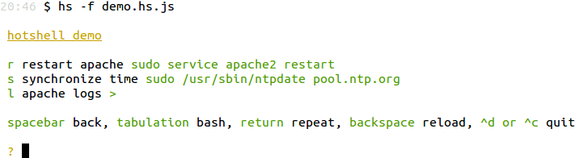

# Hotshell : Command-line productivity enhancer

Hotshell is a command-line application to efficiently recall and share commands :



For a demo of what this project is about, please check [julienmoumne.github.com/hs](https://julienmoumne.github.com/hs)

# Table of Contents

  - [Hotshell Installation](#hotshell-installation)
    * [Precompiled packages](#precompiled-packages)
    * [Install from source](#install-from-source)
  - [Menu Definitions](#menu-definitions)
    * [Building blocks](#building-blocks)
    * [Examples](#examples)
    * [JavaScript Runtime](#javascript-runtime)
  - [Project Motives](#project-motives)
  - [Tips](#tips)

## Hotshell Installation

Hotshell is currently supported on Linux and OSX.

Support for FreeBSD and Windows pending [1](https://github.com/pkg/term/pull/15)
and [2](https://github.com/pkg/term/issues/8) or alternative solutions.

### Precompiled packages

 - Linux : see [releases](https://github.com/julienmoumne/hs/releases)
 - OSX :
```bash
brew install https://raw.githubusercontent.com/julienmoumne/homebrew/b8ebeb6fc43686c8f42a86c6e3cd30d0bf694967/Library/Formula/hs.rb
```

### Install from source

```bash
go get github.com/julienmoumne/hs/cmd/hs
```

## Menu Definitions
 
Menus are defined using a JavaScript DSL.

### Building blocks

Menus are first defined with a top-level *menu item*
```javascript
item({desc: 'top level menu'}, function() {
    
})
```
*Command items* associate bash commands to hot keys
```javascript
item({desc: 'top level menu'}, function() {
    
  item({key: 's', cmd: 'sudo service apache2 status'})      
  item({key: 'r', cmd: 'sudo service apache2 restart'})      
  
  // a description can be used to clarify the command intent
  item({key: 'a', desc: 'access logs', cmd: 'less +F /var/log/apache2/access.log'})
  item({key: 'e', desc: 'error logs', cmd: 'less +F /var/log/apache2/error.log'})
})
```
*Submenus and Description items* can be used to add structure
```javascript
item({desc: 'top level menu'}, function() {
    
  item({desc: 'this is a description item, you can use it to describe the menu\n'})
  
  // a submenu to manage apache's daemon
  item({key: 'm', desc: 'apache management'}, function() {
    item({key: 'r', cmd: 'sudo service apache2 restart'})      
    item({key: 'h', cmd: 'sudo service apache2 stop'})
  })
  
  // a submenu to access apache's logs
  item({key: 'l', desc: 'apache logs'}, function() {
    item({key: 'a', desc: 'access', cmd: 'less +F /var/log/apache2/access.log'})
    item({key: 'e', desc: 'error', cmd: 'less +F /var/log/apache2/error.log'})
  })      
})
```
See a [simulated demo](https://julienmoumne.github.com/hs/demos/tutorial.hs.js.html) of the resulting menu.
 
### Examples

Check out some fully-featured [examples](/examples).

The project can greatly benefit from additional examples of menus.
Examples can be contributed to the project by creating a pull request.

### JavaScript Runtime

The DSL is interpreted using Otto, an embeddable JavaScript interpreter.
See [Otto](https://github.com/robertkrimen/otto) and
[Otto Underscore](https://github.com/robertkrimen/otto/tree/master/underscore) 
for available JavaScript functions.

A custom function, `exec`, is provided to interact with the system when
defining menus.

Examples :

  - retrieve environment variables
```javascript
httpPort = exec('echo $HTTP_PORT')
item({key: 's', desc: 'start http server', cmd: 'python -m SimpleHTTPServer ' + httpPort})
```
  - conditionally set-up items
```javascript
linux = exec('uname').indexOf('Linux') > -1
item({key: 'u', desc: 'update', cmd: linux ? 'sudo apt-get update' : 'brew update'})
```
  - dynamically create menus
```javascript
recentlyUpdatedLogs = exec('ls -dt /var/log/*.* | head -n 3').split('\n')
_.each(recentlyUpdatedLogs, function(el, ix) {
  item({key: ix, desc: 'less ' + el, cmd: 'less +F ' + el})
})
```


*exec* executes the specified command using `bash -c` and returns
the stdout if the command returned a non-zero exit code.

In case of failure, stderr is displayed in the menu without stopping the interpretation of the DSL.

## Project Motives

### Being more productive using the shell

As developers and system admins we sometimes spend too much time finding and typing commands on the shell.

We rely on a variety of methods to recall commands : 
search engines, reverse-search-history, previous-history, aliases, auto-completion, scripts, ..

While they are effective, they require superfluous lookups and keystrokes.

I have found myself searching too many times how to lookup patterns in files or checking if a port is open.

Hotshell can be used to define a system wide menu containing such commands :

```javascript
// file ~/.hs/hs.js  
item({desc: 'useful system commands'}, function() {
  item({key: 'f', desc: 'find text in files', cmd: 'echo -n "[location] [pattern] " && read l p && grep -rnws $l -e $p'})
  item({key: 'o', desc: 'check local port', cmd: 'echo -n "[port] " && read p && cat < /dev/tcp/127.0.0.1/$p'})
  // other useful commands..
})
```

### Sharing commands with your team

When working in teams we usually go through common steps such as compiling,
testing, restarting servers, cleaning directories, looking at log files, installing dependencies, ..

Some of these commands may be available on your IDE, some may not. Team members may not always have the 
same IDEs.

Most of the time though, IDE task configurations are not committed into the VCS and are therefore not shared.

We can discover productivity tricks in documentation, more often than not, we learn them
while pair programming.

Hotshell proposes both a way to :

  - embody skills of team members
  - produce executable documentation
  
As an example, checkout [Hotshell's hotshell](examples#hotshells-hotshell)

## Tips

  - Implicitly load the current directory's hotshell (**./hs.js**), or if not found, the system-wide hotshell (**~/.hs/hs.js**)
```bash
hs
```
  - Specify the path to the definition file
```bash
hs -f ~/projects/web/hs.js
# or
hs -f ~/projects/web
```
  - Load a menu remotely
```bash
hs -f https://raw.githubusercontent.com/julienmoumne/hs/v0.1.0/hs.js
```
  - Set the working directory to the location of the menu definition
```bash
hs --chdir -f ~/projects/web/hs.js
```
  - Include menus defined in separate files, see [composite example](examples#composite)
  - Hotshell works well with commands that require input
```javascript
item({cmd: 'ssh remote-server'})
item({cmd: 'sudo vim /etc/hosts'})
# prompts for a location and a pattern and triggers a grep search
item({desc: 'find text in files', cmd: 'echo -n "[location] [pattern] " && read l p && grep -rnws $l -e $p'})
```
  - The DSL defined by Hotshell uses some JavaScript tricks, learn more about it : http://alexyoung.org/2009/10/22/javascript-dsl/
  - There is a good number of command examples in the default hotshell
```bash
hs --default
```
  - When running out of characters for defining hot keys, use capital letters
```javascript
item({key: 'S', cmd: 'ssh remote-server'})
```
  - Use aliases
```bash
alias hsdocker="hs -f https://raw.githubusercontent.com/julienmoumne/hs/v0.1.0/examples/docker/docker.hs.js"
```
  - Generate an interactive HTML demo of your menus, [example](https://julienmoumne.github.com/hs/demos/hs.js.html)
```bash
hs --generate-demo -f ~/projects/web/hs.js > hotshell-web-demo.html  
```

[Anonymised Public Analytics by Piwik Cloud](https://hotshell.piwik.pro)