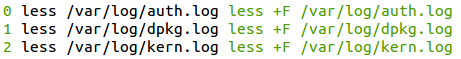

# Tips

  - [Command-line usage](#command-line-usage)
  - [Menu and item definition](#menu-and-item-definition)
  - [Exec](#exec)
  - [Published patterns](#published-patterns)

## Command-line usage

> Implicitly load the current directory's hotshell, `./hs.js`, or if not found, the system-wide hotshell `~/.hs/hs.js`

```bash
hs
```

> Specify the path to the definition file

```bash
hs -f ~/projects/web/hs.js
```

> Generate a markdown documentation of your menus, [example](./examples/network/network.hs.js.md)

```bash
hs --generate-md > COMMANDS.md  
```

> Load a menu remotely (does not work when using [modules](examples#modules))

```bash
H='raw.githubusercontent.com/julienmoumne/hotshell/v0.1.0/hs.js'; T=`mktemp`; wget $H -qO $T && hs -f $T; rm $T
```

> Use aliases

```bash
# user hotshell
alias hs-home="hs -f ~/.hs/hs.js"

# project hotshell
alias hs-someproject="cd ~/work/someproject; hs"
```

> Generate an interactive HTML demo of your menus, [example](http://julienmoumne.github.io/hotshell/demos/hs.js.html)

```bash
hs --generate-demo -f ~/projects/web/hs.js > hotshell-web-demo.html  
```

## Menu and item definition

> Output the definition objects to help debugging :

```javascript
var hotshell = require('hotshell')
var item = hotshell.item

function log(val) { console.log(JSON.stringify(val, null, ' ')) }

item({desc: 'debug'}, function () {
  item({key: 'r', desc: 'restart apache', cmd: 'sudo service apache2 restart'})
  // 'current' contains the item currently built
  // in this case the root menu named 'debug' with only one item so far
  log(hotshell.current)
  item({key: 'a', desc: 'access.log', cmd: 'less +F /var/log/apache2/access.log'})
}) 

// 'items' contains the whole definition
log(hotshell.items)
```
displays
```javascript
{
 "desc": "debug",
 "items": [
  {
   "cmd": "sudo service apache2 restart",
   "desc": "restart apache",
   "key": "r",
   "wd": "./"
  }
 ],
 "wd": "./"
}
[
 {
  "desc": "debug",
  "items": [
   {
    "cmd": "sudo service apache2 restart",
    "desc": "restart apache",
    "key": "r",
    "wd": "./"
   },
   {
    "cmd": "less +F /var/log/apache2/access.log",
    "desc": "access.log",
    "key": "a",
    "wd": "./"
   }
  ],
  "wd": "./"
 }
]
```
  
> Commands can receive inputs from the user with bash builtin [read](http://wiki.bash-hackers.org/commands/builtin/read) 

```javascript
item({key: 'p', desc: 'check local port', cmd:
    'echo -n "[port] "; ' + // prompt for port number
    'read p; ' + // read port number and assign it to variable 'p'
    'cat < /dev/tcp/127.0.0.1/$p' // check if port 'p' is opened locally
})

item({key: 'f', desc: 'find text in files', cmd:
    'echo -n "[location] [pattern] "; ' + // prompt for location and pattern
    'read l p; ' + // read location and pattern into variables 'l' and 'p'
    'grep -rnws $l -e $p' // search for pattern 'p' traversing files rooted at 'l'
})
```

Use this pattern with less effort by importing [Hotshell Util](https://github.com/julienmoumne/hotshell-util).

> Enter other interactive applications

```javascript
item({key: 's', cmd: 'ssh remote-server'})
item({key: 'h', cmd: 'sudo vim /etc/hosts'})
```

> Call scripts
 
```javascript
item({key: 'b', desc: 'bash script', cmd: './script.sh'})
item({key: 'p', desc: 'python script', cmd: './script.py'})
```

> When running out of characters for defining hot keys

```javascript
// use capital letters and unicode characters
item({key: 'S', cmd: 'ssh remote-server'})
item({key: 'Ô', cmd: 'ssh remote-server'})

// or group commands in submenus
item({key: 'g', desc: 'group of related commands'}, function () {

  // the complete alphabet is available
  item({key: 'a', cmd: 'echo a'})
  item({key: 'b', cmd: 'echo b'})
})
```

> Retrieve variables from a file

```javascript
item({key: 'o', cmd: 'source ./variables && open $WEBSITE_URL'})
```

```bash
# file ./variables
WEBSITE_URL=http://julienmoumne.github.io/hotshell
```


> Factor groups of commands

See [network example](examples#network)

> Modularize menu definitions

See [modules example](examples#modules)

> Import JSON data

```javascript
var data = require('./data.json')
```

> Nest Hotshells

See [nested hotshells](examples#nested-hotshells)

> There is a good number of command examples in

 - the default hotshell `hs --default`
 - the [examples directory](./examples)

> Need to understand how the DSL is interpreted?

see [Building Trees using a JavaScript DSL](http://moumne.com/2016/07/30/building-trees-using-a-javascript-dsl)

## Exec

> Retrieve environment variables
  
```javascript
var exec = require('hotshell').exec

var httpPort = exec('echo $HTTP_PORT'); if (httpPort == '') throw 'please set $HTTP_PORT'

item({key: 's', desc: 'start http server', cmd: 'python -m SimpleHTTPServer ' + httpPort})
```

> Conditionally set-up items based on the result of system commands
  
```javascript
var exec = require('hotshell').exec

var linux = exec('uname').indexOf('Linux') > -1

item({key: 'u', desc: 'update', cmd: linux ? 'sudo apt-get update' : 'brew update'})
```

> Dynamically create menus
  
```javascript
var exec = require('hotshell').exec

var recentlyUpdatedLogs = exec('ls -dt /var/log/*.* | head -n 3').split('\n')

_(recentlyUpdatedLogs).each(function(el, ix) {
  item({key: ix, desc: 'less ' + el, cmd: 'less +F ' + el})
})
```

> 'console.log()' can be used to help debugging

```javascript
var exec = require('hotshell').exec

console.log(exec('echo $(date)'))
```

## Published patterns

Some patterns are published in separate projects
and can easily be integrated in your menus using npm, e.g : 
 - [hotshell-util](https://www.npmjs.com/package/hotshell-util)
 - [hotshell-docker](https://www.npmjs.com/package/hotshell-docker)
